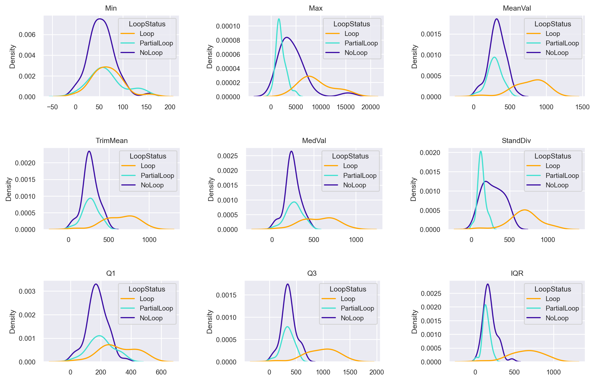
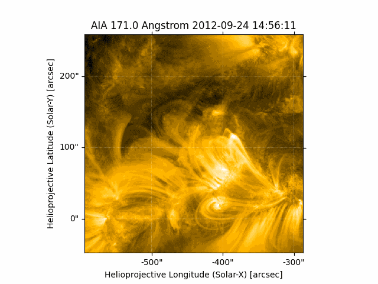

# Coronal Loops Repo Overview

This repository provides tools for working with FITS astronomical images, focusing on the study of coronal loops. The repository offers functionalities for downloading, selecting regions, analyzing, and experimenting with image data. Below is a summary of the main features:

### Features

1. **Downloading High-Quality Images**:
   - Download high-quality astronomical images for specific dates using Astropy and Sunpy.
   
2. **Interactive Region Selection**:
   - Interactively select a region within a FITS image and automatically save the selection.
   
3. **Statistical Analysis of Selected Regions**:
   - Perform statistical analysis on selected regions with coronal loops to define criteria for regions of interest.
   
4. **Automated Region Selection**:
   - Automatically select regions based on predefined statistical criteria.
   
5. **Experiments for Objective Mask Generation**:
   - Conduct experiments aimed at developing automated methods for generating objective masks of coronal loops. This feature is still under refinement but shows promising results.

### Installation

To use the tools in this repository, you need to install the required dependencies:

```bash
pip install -r requirements.txt
```

----------------------------------

## Acquiring SDO: Downloading High-Quality Images
This documentation provides a step-by-step guide on acquiring images from the Solar Dynamics Observatory (SDO) using Python and the SunPy library. SDO provides high-resolution images of the Sun in multiple wavelengths, captured by instruments like the Atmospheric Imaging Assembly (AIA).

-------------------------------------

## SelectionCutout: Interactive Region Selection

### fitsImages Class from `SelectionCutOut.py` 

The `fitsImages` class is designed to facilitate the easy manipulation of FITS images. It provides methods to interactively select regions of interest within FITS images, extract sub-images (cutouts) from those regions, and save the sub-images to files. Additionally, it offers functionality to visualize and animate FITS images and their sub-images.

#### Usage

To utilize the `fitsImages` class effectively, follow these steps:

1. **Import Dependencies**:
   - Make sure to import the required libraries installed in your working environment:
     ```python
  conda install matplotlib astropy sunpy pandas numpy scipy
     ```
     or 
      ```python
  pip install matplotlib astropy sunpy pandas numpy scipy
     ```
   - Import `SelectionCutOut.py` to your notebook/script
     ```python
     import SelectionCutOut
     from SelectionCutOut import fitsImages
     ```


2. **Instantiate `fitsImages` Object**:
   - Create an instance of the `fitsImages` class by passing the path to the folder containing the FITS images:
     ```python
     fits_images_obj = fitsImages("/path/to/images/folder/")
     ```

3. **Select Regions of Interest**:
   - Use the `SelecToCutOut()` method to select regions of interest within the FITS images and extract sub-images (cutouts). Optionally, specify an output folder name and cutout size:
     ```python
     fits_images_obj.SelecToCutOut(OutputFolderName="NewSubImages/", CutoutSize=512)
     ```
    - Select the left lower corner of the region of interest.

4. **Visualize and Animate Images**:
   - Utilize the `animate()` method to visualize and animate the original FITS images or their sub-images:
     ```python
     fits_images_obj.animate()
     ```

#### Methods

The `fitsImages` class provides the following methods for manipulating FITS images:

- **`__init__(self, ImagesFolderPath)`**: Constructor method to initialize the `fitsImages` object with the path to the folder containing the FITS images.

- **`SelecToCutOut(self, OutputFolderName="NewSubImages/", CutoutSize=512)`**: Method to select regions of interest within the FITS images, extract sub-images (cutouts), save them to files and view the subimages as animation. Parameters:
  - `OutputFolderName`: Name of the output folder to store the sub-images (default is "NewSubImages/").
  - `CutoutSize`: Size of the square cutout (default is 512 pixels).

- **`animate(self, subImages=False)`**: Method to visualize and animate the FITS images or their sub-images. Parameters:
  - `subImages`: Boolean flag to indicate whether to animate sub-images (default is False).

#### Notes

By following these guidelines and utilizing the provided `fitsImages` class, you can efficiently work with FITS images, extract sub-images, and visualize your data in Python.

-----------------------------------


### Results for Statistical Analysis of Selected Regions



### Animation of Auto Selected Regions based on Statistical Criteria

-----------------------------------

## LoopStatAnalysisPartialLoops: Statistical Analysis of Selected Regions

The file "LoopStatAnalysisPartialLoop.csv" contains data extracted from manually segmented images, featuring summary statistics for each image. Below is a breakdown of the available columns:

- **ImageFile:** The filename of each image.
- **LoopStatus:** Categorization of each image based on loop status (e.g., "Full Loop," "No Loop," "Partial Loop").
- **Min:** The minimum value of the pixel intensities within the image.
- **Max:** The maximum value of the pixel intensities within the image.
- **MeanVal:** The mean value of the pixel intensities within the image.
- **TrimMean:** The trimmed mean of the pixel intensities within the image, calculated by removing a specified percentage of outliers from both ends of the distribution.
- **MedVal:** The median value of the pixel intensities within the image.
- **StandDiv:** The standard deviation of the pixel intensities within the image, indicating the dispersion of values from the mean.
- **Q1:** The first quartile (25th percentile) of the pixel intensities within the image.
- **Q3:** The third quartile (75th percentile) of the pixel intensities within the image.
- **IQR:** The interquartile range (Q3 - Q1) of the pixel intensities within the image, representing the spread of the middle 50% of the data.

Each row in the CSV file represents summary statistics for a single image, providing insights into the distribution and characteristics of pixel intensities within the corresponding region of interest. This data can be further analyzed to investigate trends, patterns, and differences between images categorized by loop status.

---------------------------------------

**Data.zip File**

The "Data.zip" file contains datasets categorized into different classes of images. Below is a brief overview of the contents of the zip file:

- **Loop:** This folder contains images showcasing complete coronal loops.
- **NoLoop:** Images in this folder do not feature any visible coronal loops.
- **PartialLoop:** Images in this folder display coronal loops that are partially visible or incomplete.
- **Dark:** This folder contains images representing dark regions.

Each class of images is organized into separate folders within the "Data.zip" file, allowing for easy access and analysis of the data.

--------------------------------------

**StatisticalAnalysis.ipynb**

The purpose of the "StatisticalAnalysis.ipynb" notebook is to conduct statistical analysis on sample images. Its goal is to derive statistical criteria for determining areas in the image that contain loops. Through descriptive statistics, hypothesis testing, correlation analysis, and possibly regression analysis, the notebook aims to extract meaningful insights to identify loop regions within the images.

Data sampling was carried out by usage of `SelectCutOut` function from **SelectionCutOut.py** . This script designed to facilitate the easy manipulation of FITS images. It provides methods to interactively select regions of interest within FITS images, extract sub-images (cutouts) from those regions, and save the sub-images to files. Additionally, it offers functionality to visualize and animate FITS images and their sub-images. 

-----------------------------------------

## AutoSelect: Automated Region Selection

This Python script, `AutoSelect.py`, is designed to process fits files containing solar images. It identifies loop structures within the images based on certain statistical criteria and saves the detected loop regions as separate fits files. The statistical criteria is obtained from the statustucal analysis of the previous step, and can be modified accordingly.

## Dependencies
- Python 3.x
- `matplotlib`
- `astropy`
- `sunpy`

Ensure you have these dependencies installed before running the script. You can install them using `pip`:

```bash
pip install matplotlib astropy sunpy
```

#### Usage
1. **Navigate to Directory**: Navigate to the directory where `LoopAutoSelect.py` is located.

2. **Run Script**: Run the script from the command line with the following command:


```bash
python LoopAutoSelect.py <fits_file>  <output_path>
```
- `<fits_file>`: Path to the fits file containing solar images.
- `<output_path>`: Path to the directory where processed images will be saved.


#### Functionality
- The `LoopAutoSelect.py` script processes images using a sliding window method. It selects regions within the images where the mean pixel value is greater than 304.85 and the interquartile range (IQR) is greater than 470. These threshold values were determined through statistical analysis.
- Additionally, the script filters images that have up to 50% overlap of their areas. In case of overlap, the script selects the image with the highest mean and IQR values.
- Detected loop regions that meet certain criteria (mean and IQR) are saved as separate fits files in the specified output directory.
- Each saved fits file contains a subregion of the original image corresponding to a detected loop structure.

#### Additional Notes
- Ensure that the fits file provided as input contains solar images and is compatible with the processing methods implemented in the script.
- Adjust the parameters (`x1_position`, `x2_position`, `y1_position`, `y2_position`, `x_step`, `y_step`, `size`, `mean_crit`, `iqr_crit`) within the script according to your specific requirements for image processing and loop detection.
- For further details on the implemented algorithms and methods, refer to the comments within the script.

------------------------------------

## TestsToCreateMasks: Experiments for Objective Mask Generation

These experiments are part of a research project aimed at developing efficient methods for identifying objective masks for coronal loops, which can be used to train deep learning models. Human annotation can be subjective, time-consuming, and prone to errors, which can lead to inconsistencies in the labeling process. Additionally, the complexity of coronal loops and the variability in solar images can make it challenging for humans to accurately identify them.
By developing automated methods for generating objective masks, we can reduce the reliance on human annotation and improve the accuracy and efficiency of the process. Deep learning models, in particular, can learn to recognize patterns in solar images and segment coronal loops with high accuracy, once trained on a large dataset of labeled examples. 
"objective masks" mean binary images where pixels corresponding to coronal loops are labeled as 1 (or true) and pixels corresponding to the background are labeled as 0 (or false). These masks can be used as ground truth for training deep learning models to segment coronal loops from solar images. 
